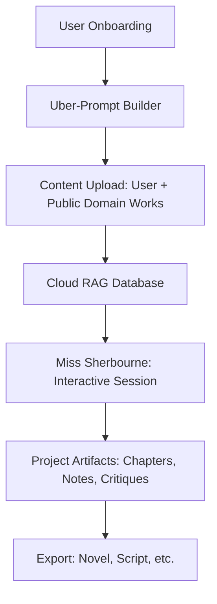
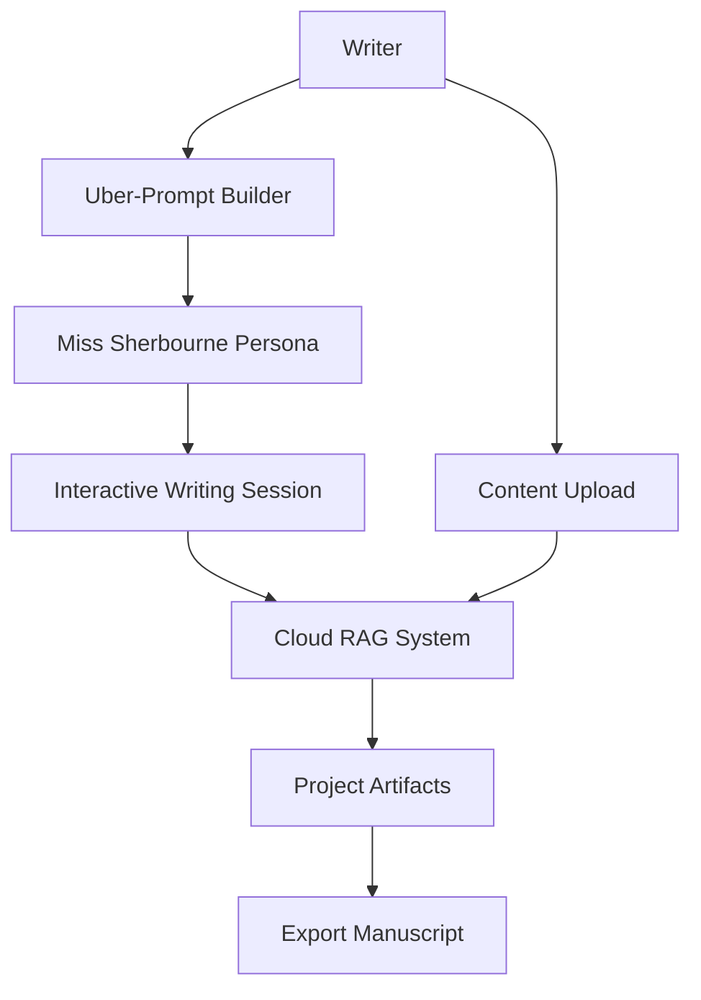
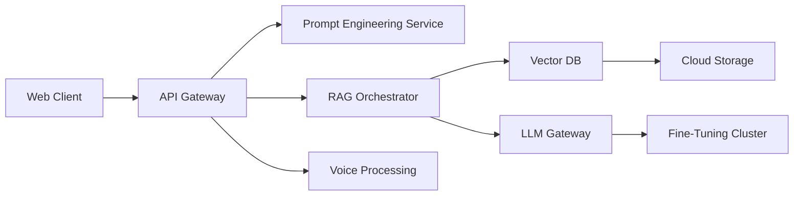
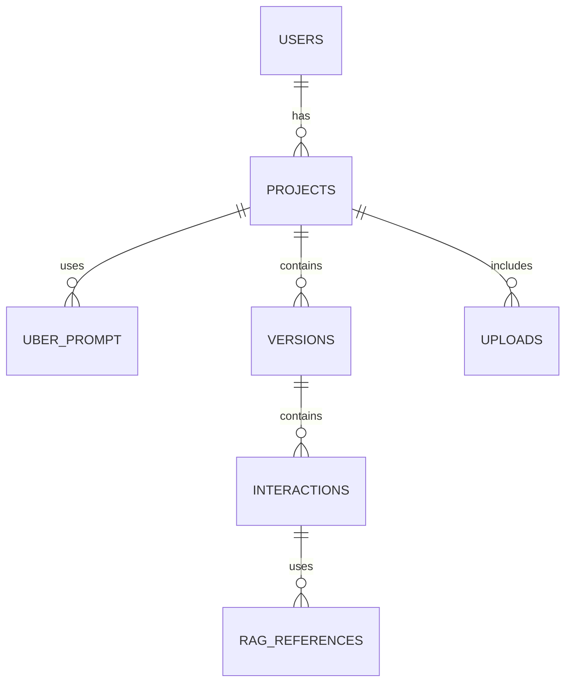
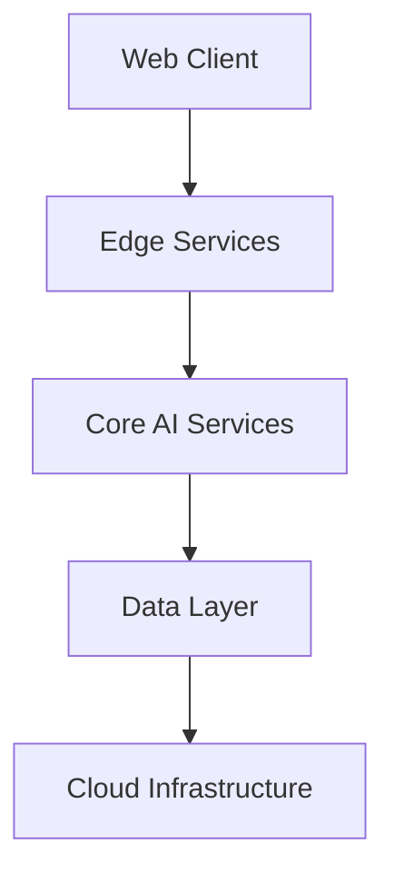
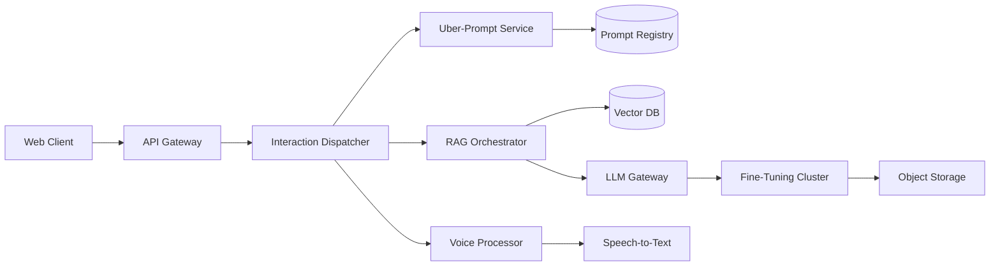
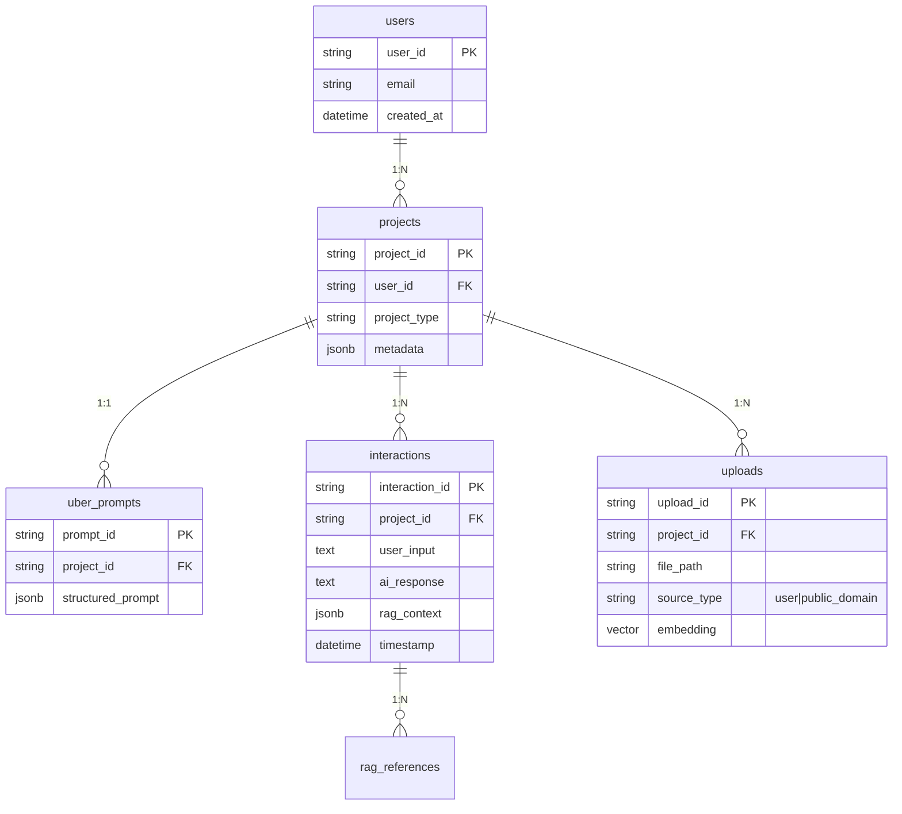
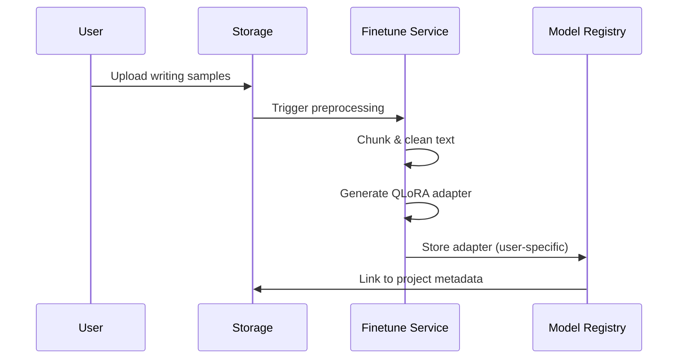
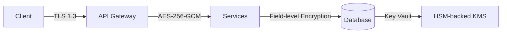
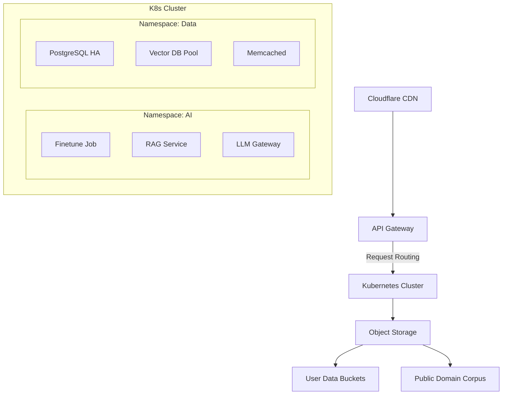

This is a **specific** vision—a cloud-based, opinionated creative writing mentor ("Miss Sherbourne") that combines **structured prompt engineering**, **user-guided RAG**, and **interactive project scaffolding**. Here’s how to architect it:

---

### **System Architecture Overview**


---

### **Key Components & Tech Stack**
#### **1. Web App (Cross-Platform)**
- **Frontend**: Next.js (React) + TailwindCSS  
- **State Management**: Zustand (for session tracking)  
- **Voice/Text**: Web Speech API (transcription) + Whisper (backup)  

#### **2. Uber-Prompt Engineering Workflow**
- **Step-by-Step Q&A** to define:  
  - Genre  
  - Tone (e.g., "Gritty Victorian" vs. "Whimsical SF")  
  - Narrative style (1st/3rd person, tense)  
  - Miss Sherbourne’s persona (strictness, focus areas)  
- **Output**: A structured prompt like:  
  ```text
  "You are Miss Sherbourne, a strict creative writing instructor specializing in [genre]. 
  Your feedback is blunt but constructive. Prioritize [aspects]. Never allow [taboos]. 
  Current project: [summary]. Next, ask the user 3 questions about their protagonist’s flaws."
  ```

#### **3. Cloud RAG System**
- **Database**: PostgreSQL + pgvector (for embeddings)  
- **Embedding Model**: `text-embedding-3-small` (OpenAI) or `bge-small` (open-source)  
- **Retrieval**: Hybrid search (keyword + vector) for past interactions/uploaded docs  

#### **4. Training Pipeline (User Data)**
- **Fine-Tuning**: LoRA adapters per-user (via Modal or RunPod)  
  - Base model: `Mistral 7B` or `Llama 3`  
  - Datasets: User’s past works + public domain (Project Gutenberg)  
- **Isolation**: Dedicated storage per user (e.g., AWS S3 buckets)  

#### **5. Miss Sherbourne’s Personality Engine**
- **Critique Templates**:  
  ```python
  def generate_critique(text):
      if "plot hole" in analyze_text(text):
          return "This section lacks coherence. [EXAMPLE FROM RAG]. Try: [SUGGESTION]"
      elif "passive voice" in analyze_text(text):
          return "Too limp! Strike with active verbs like Hemingway: [RAG EXAMPLE]"
  ```
- **Opinionated Defaults**:  
  - "You haven’t described the setting. Start with 3 sensory details."  
  - "Your antagonist feels shallow. Here’s a character questionnaire."  

---

### **User Flow Example**
1. **Onboarding**:  
   - User selects _"Start New Novel"_ → Uber-Prompt builder asks 10 questions.  
2. **Upload**:  
   - Drag/drop past works + public domain inspirations.  
3. **Session**:  
   ```plaintext
   Miss Sherbourne: "Your protagonist lacks a visible wound. How did their childhood shape them?"
   User: [Types/Voices response]
   Miss S: "Too vague! Here’s how Dickens would do it: [RAG-retrieved excerpt]."
   ```
4. **Output**:  
   - Auto-organized project with chapters, critiques, and references.  

---

### **Tech Stack Details**
| Component           | Tools/APIs                                                                 |  
|---------------------|----------------------------------------------------------------------------|  
| **Cloud RAG**       | Supabase (PostgreSQL + pgvector), LangChain for retrieval                  |  
| **Fine-Tuning**     | Modal ($0.20/hr GPU instances), Unsloth for fast LoRA                      |  
| **Voice**           | Web Speech API (client-side) + Whisper API (fallback)                      |  
| **Auth/Storage**    | Firebase Auth + S3 (user-specific buckets)                                 |  
| **LLM Hosting**     | Anyscale/Mistral API (for cloud), Ollama (user-local opt-in)               |  

---

### **Critical Features**
1. **Strict Persona Guardrails**:  
   - Prevent Miss Sherbourne from becoming too nice:  
     ```python
     prompt += "Never use platitudes. Demand revision if prose is clichéd."
     ```
2. **Project Memory**:  
   - Every interaction is embedded and retrievable.  
   - Example: _"Last week you said the theme is ‘redemption’—why does this scene ignore that?"_  
3. **Export Formats**:  
   - Manuscript (`.docx`), Lore Bible (`.md`), Audio Recap (ElevenLabs).  

---

### **Copyright & Privacy**
- **User Data**: Never used for training beyond their instance.  
- **Public Domain**: Pre-loaded CC0/Project Gutenberg texts (filtered for relevance).  
- **ToS Clause**:  
  ```text
  "You retain all rights to uploaded content. Miss Sherbourne’s feedback is AI-generated suggestion."
  ```

---

### **Why This Works**
- **Structured Creativity**: Writers get both freedom and discipline.  
- **Voice-Driven**: Feels like collaborating with a real editor.  
- **Scalable**: LoRA adapters are tiny (~10MB/user).  

---

### **Challenges & Mitigations**
| Challenge                          | Solution                                  |  
|------------------------------------|-------------------------------------------|  
| **Miss Sherbourne feels robotic**  | Inject randomness (e.g., 5% sarcasm mode)|  
| **Cost of cloud RAG**              | Cache frequent queries, tiered storage   |  
| **Overwhelming critiques**         | "Gentle Mode" toggle for new writers     |  

---

### **Next Steps**
1. **Prototype the Uber-Prompt Builder**:  
   - Use a form lib (React Hook Form) to guide users.  
2. **Mock Miss Sherbourne**:  
   - Hardcode critiques for a test novel chapter.  
3. **Build a Minimal RAG**:  
   - Supabase + OpenAI embeddings (free tier).  

Want to dive into any of these? For example:  
- A sample Uber-Prompt for "Gothic Horror".  
- How to structure the RAG database schema.  
- Voice interaction design patterns.  


=========================


# Project Sherbourne: The Opinionated AI Writing Mentor  
*An AI-powered creative writing platform that combines structured guidance, personalized feedback, and uncompromising editorial standards*



## Product Vision  
Sherbourne transforms creative writing by pairing AI capabilities with a structured pedagogical approach. Unlike generic writing assistants, Sherbourne acts as a digital writing mentor with strong opinions and high standards - "Miss Sherbourne" - who guides writers through the creative process while maintaining their unique voice.

### Core Features  
- **Persona-Driven Interaction**: Miss Sherbourne's strict British mentor persona  
- **Uber-Prompt Engineering**: Guided Q&A builds custom project blueprints  
- **Multi-Source RAG**: Unified knowledge from user content + public domain works  
- **Project Memory System**: Captures all interactions as writing assets  
- **Voice-to-Process**: Dictate conversations with your AI mentor  
- **Style Preservation**: Fine-tuned adaptation to writer's unique voice  

**Target Users**:  
- Novelists seeking developmental editing  
- Screenwriters needing structural guidance  
- Content creators combating writer's block  
- Writing students desiring professional critique  

---

## Technical Specification  

### System Architecture  


### 1. Core Components  
#### Uber-Prompt Builder  
- **Function**: Creates project-specific instruction sets through guided dialog  
- **Process**:  
  1. Genre/Tone Assessment (20+ question profile)  
  2. Narrative Voice Calibration (writing sample analysis)  
  3. Persona Configuration (strictness, focus areas)  
  4. Project Scaffolding (chapter-by-chapter or discovery mode)  
- **Output**: Structured JSON prompt with:  
  ```json
  {
    "persona": "strict_british_mentor",
    "project_rules": ["no_adverbs", "show_dont_tell"],
    "current_focus": "character_development",
    "next_steps": ["setting_description", "conflict_escalation"]
  }
  ```

#### Miss Sherbourne Persona Engine  
- **Core Principles**:  
  - **Blunt but constructive** criticism  
  - **Proactive questioning** to uncover plot holes  
  - **Reference-driven suggestions** (RAG-powered examples)  
- **Implementation**:  
  - Custom system prompt with 3 personality layers:  
    ```python
    base_persona = "Strict Cambridge writing tutor"
    project_rules = uber_prompt['constraints']
    session_context = last_3_interactions
    ```
  - Dynamic tone adjustment based on writer resistance  

#### Project Memory RAG System  
- **Data Layers**:  
  | Layer | Content | Storage |  
  |-------|---------|---------|  
  | L1 | User conversations | PostgreSQL |  
  | L2 | Uploaded manuscripts | S3 + pgvector |  
  | L3 | Public domain references | FAISS index |  
- **Retrieval Features**:  
  - Cross-references current writing with similar passages  
  - Flags continuity errors against earlier chapters  
  - Surfaces relevant critique templates  

### 2. AI Infrastructure  
- **Base Models**:  
  - Mistral 7B (fine-tuning)  
  - GPT-4-Turbo (complex analysis)  
  - Claude 3 (long-context processing)  
- **Fine-Tuning Approach**:  
  - Per-user LoRA adapters (avg. 12MB)  
  - Progressive training during uploads  
  - Style transfer validation via BERTScore  
- **RAG Pipeline**:  
  ```mermaid
  sequenceDiagram
      Writer->>+RAG Engine: Submit draft paragraph
      RAG Engine->>+Vector DB: Semantic search
      Vector DB-->>-RAG Engine: Top 5 matches
      RAG Engine->>+Critique Model: Generate feedback
      Critique Model-->>-RAG Engine: Annotated response
      RAG Engine->>+Writer: Miss Sherbourne's critique
  ```

### 3. Data Architecture  
**Storage Schema**:  


- **Security Measures**:  
  - End-to-end encryption for user content  
  - VPC-isolated training environments  
  - GDPR-compliant data handling  
- **Copyright Safeguards**:  
  - Upload content validation (copyright detection API)  
  - Public domain verification layer  
  - Watermarked AI outputs  

### 4. UX Workflow  
1. **Onboarding**:  
   - Create writer profile (voice/style preferences)  
   - Select project type (novel, screenplay, memoir)  
   - Build Uber-Prompt through 10-min Q&A  

2. **Content Ingestion**:  
   - Upload past works (PDF, DOCX, EPUB)  
   - Select public domain supplements  
   - Voice-record writing concepts  

3. **Writing Session**:  
   ```plaintext
   Miss S: "Your protagonist's motivation remains unclear.  
            Compare with Austen's Elizabeth Bennet: [RAG excerpt].  
            How does your character react to betrayal?"  
   [User dictates response]  
   Miss S: "Too emotional! Refine using objective correlatives."  
   ```

4. **Project Export**:  
   - Manuscript in standard formats  
   - "Writer's Bible" with all interactions  
   - Audio summary of developmental progress  

---

## DeepThink Insights  

### Psychological Foundations  
**Structured Creativity Paradox**:  
Research shows constraints boost creativity (Stokes, 2006). Miss Sherbourne's strictness leverages:  
- **Cognitive Scaffolding**: Breaking complex tasks into manageable critiques  
- **Accountability Effect**: Anthropomorphized mentor increases commitment  
- **Productive Discomfort**: Optimal frustration level stimulates growth  

### Technical Innovations  
1. **Persona Continuity System**:  
   - Tracks personality consistency through:  
     ```python
     persona_fidelity = cosine_similarity(
         current_response_embedding, 
         persona_base_embedding
     )
     ```
   - Triggers recalibration when fidelity < 0.82  

2. **Anticipatory RAG**:  
   - Predicts needed references based on:  
     - Current writing phase (exposition/conflict/resolution)  
     - Writer's recurring weaknesses  
     - Narrative arc position  

3. **Voice-Print Adaptation**:  
   - Converts speech patterns to stylistic preferences:  
     | Speech Trait | Writing Adaptation |  
     |-------------|-------------------|  
     | Fast tempo | Short sentences |  
     | Pauses | Em-dash usage |  
     | Pitch variance | Emotional tone |  

### Ethical Considerations  
- **Agency Preservation**: Always clear when writer overrides suggestions  
- **Bias Mitigation**:  
  - Public domain corpus balanced across eras/genders  
  - Cultural sensitivity filters for critique templates  
- **Burnout Prevention**: Session pacing algorithms detect frustration  

---

## Roadmap  
| Phase | Features | Timeline |  
|-------|----------|----------|  
| Alpha | Core writing session + PDF ingestion | Q3 2025 |  
| Beta | Voice integration + public domain RAG | Q1 2026 |  
| 1.0 | Multi-project workspace + collaboration | Q3 2026 |  
| Future | Audiobook generation + agent-based characters | 2027 |  

---

> "Sherbourne doesn't just assist writing - it cultivates writers. By combining AI capabilities with structured pedagogy, we create the digital equivalent of a master-apprentice relationship scaled for the modern creator." - Project Manifesto

*Technical Appendix Available Upon Request*


# Technical Appendix: Project Sherbourne  
*Detailed specifications for implementation*



## 1. System Architecture  

### Component Diagram  


### Technology Stack  
| Layer | Component | Technology |  
|-------|-----------|------------|  
| **Client** | Web Frontend | React 19 + Vite, TailwindCSS, Web Speech API |  
| **Edge** | API Gateway | Cloudflare Workers + Durable Objects |  
| **Services** | Prompt Engineering | Python 3.12, FastAPI |  
|  | RAG Orchestrator | LangChain, LlamaIndex |  
|  | Voice Processing | Whisper.cpp (WASM), WebAudio API |  
| **AI** | Base Models | Mistral 7B, GPT-4-Turbo, Claude 3 Haiku |  
|  | Fine-Tuning | LoRA via Unsloth, 4-bit quantization |  
| **Data** | Vector DB | pgvector 0.7.0 (PostgreSQL 16) |  
|  | Metadata Store | Supabase (PostgreSQL) |  
|  | File Storage | S3-compatible (MinIO for self-hosted) |  
| **Ops** | Containerization | Docker + Kubernetes |  
|  | Monitoring | Prometheus + Grafana |  
|  | CI/CD | GitHub Actions |  

---

## 2. API Specifications  

### Core Endpoints  
**Uber-Prompt Builder Service**  
`POST /v1/prompt-engineer`  
```json
{
  "project_type": "novel",
  "genre": "gothic_horror",
  "writing_sample": "The castle loomed...",
  "user_preferences": {
    "strictness_level": 9,
    "focus_areas": ["character_development", "atmosphere"]
  }
}
```
*Response*:  
```json
{
  "uber_prompt_id": "UP_abcd1234",
  "structured_prompt": {...},
  "first_instructions": "Begin by describing the protagonist's deepest fear..."
}
```

**RAG Interaction Service**  
`POST /v1/rag-interaction`  
```json
{
  "project_id": "proj_xyz987",
  "user_input": "Here's my opening paragraph...",
  "conversation_history": [...],
  "mode": "critique"
}
```
*Response*:  
```json
{
  "response": "Your description lacks sensory details. Consider how Poe would...",
  "rag_references": [
    {"source": "user_upload_123", "excerpt": "The floorboards groaned..."},
    {"source": "gutenberg_789", "excerpt": "A faint chill crept up..."}
  ],
  "next_step": "character_interview"
}
```

### WebSocket Services  
**Real-time Writing Session**  
`wss://api.sherbourne.app/v1/session/{session_id}`  
- Bi-directional streaming of:
  - Voice transcription chunks
  - Real-time critique suggestions
  - RAG context updates
- Heartbeat interval: 15s
- Payload structure:
  ```protobuf
  message SessionUpdate {
    string session_id = 1;
    oneof content {
      AudioChunk audio = 2;
      TextFragment text = 3;
      RagContextUpdate rag = 4;
      LlmResponse response = 5;
    }
  }
  ```

---

## 3. Data Schemas  

### Core Database Schema  


### Vector DB Indexing  
**pgvector Configuration**  
```sql
CREATE TABLE document_embeddings (
    id SERIAL PRIMARY KEY,
    project_id VARCHAR(36) NOT NULL,
    content TEXT NOT NULL,
    embedding VECTOR(1536),  -- OpenAI dim size
    metadata JSONB
);

CREATE INDEX ON document_embeddings 
USING ivfflat (embedding vector_cosine_ops) 
WITH (lists = 100);
```

**Embedding Models**  
- Primary: `text-embedding-3-small` (1536-dim)
- Fallback: `BAAI/bge-small-en-v1.5` (384-dim)

---

## 4. AI Infrastructure  

### Fine-Tuning Pipeline  


**Training Parameters**  
```yaml
base_model: "mistralai/Mistral-7B-v0.1"
quantization: "4bit"
lora_config:
  r: 16
  lora_alpha: 32
  target_modules: ["q_proj", "v_proj"]
training_args:
  per_device_train_batch_size: 4
  gradient_accumulation_steps: 8
  learning_rate: 2e-5
  max_steps: 500
  logging_steps: 25
```

### RAG Retrieval Algorithm  
```python
def hybrid_retrieval(query: str, project_id: str, k: int = 5):
    # Text embedding
    vector_results = vector_db.similarity_search(
        query, 
        k=k*2, 
        filter={"project_id": project_id}
    )
    
    # Keyword boost
    keyword_results = bm25_retriever.retrieve(
        query, 
        top_n=k*3,
        project_filter=project_id
    )
    
    # Fusion scoring
    combined = reciprocal_rank_fusion(
        vector_results, 
        keyword_results,
        k=k
    )
    
    # Freshness boost for recent uploads
    return apply_recency_bias(combined, weight=0.3)
```

---

## 5. Security Architecture  

### Data Protection Measures  
**Encryption Scheme**  


**Access Control Model**  
- RBAC with project-based isolation
- JWT claims structure:
  ```json
  {
    "sub": "user_123",
    "proj": "proj_abc",
    "permissions": {
      "rag": "read_write",
      "training": "trigger",
      "exports": "read"
    }
  }
  ```

### Compliance Features  
- **Data Residency**: Per-region storage buckets  
- **Right to Forget**: Cascading deletion triggers  
- **Audit Trail**: Immutable interaction logs  
- **Copyright Scanning**:  
  ```python
  def validate_upload(content: str) -> bool:
      if copyright_scanner.match(content, threshold=0.85):
          return False
      return public_domain_verifier.verify(content)
  ```

---

## 6. Deployment Topology  

### Cloud Architecture  


**Scaling Configuration**  
| Service | Min Replicas | Max Replicas | Scaling Metric |  
|---------|--------------|--------------|----------------|  
| API Gateway | 3 | 50 | RPS > 100/s |  
| RAG Service | 5 | 100 | P95 latency > 500ms |  
| LLM Gateway | 2 | 20 | Token processing time > 100ms |  
| Vector DB | 3 | - | Connection pool saturation > 80% |  

**Estimated Resource Costs**  
| Component | 1K Users | 10K Users |  
|-----------|----------|-----------|  
| Vector Storage | $120/mo | $1,100/mo |  
| LLM Inference | $300/mo | $2,500/mo |  
| Fine-Tuning | $0.20/GB-hr | Volume discounts |  
| Bandwidth | $85/mo | $800/mo |  

---

## 7. Quality Assurance  

### Testing Framework  
**AI-Specific Validation**  
```python
def test_persona_consistency():
    responses = generate_test_responses(scenarios=100)
    fidelity_scores = []
    
    for resp in responses:
        score = cosine_similarity(
            embed(resp), 
            embed(BASE_PERSONA_PROMPT)
        )
        fidelity_scores.append(score)
    
    assert np.mean(fidelity_scores) > 0.85, "Persona drift detected"


def test_rag_relevance():
    test_queries = load_test_dataset("writing_scenarios")
    precision_scores = []
    
    for query in test_queries:
        results = hybrid_retrieval(query)
        precision = calculate_ndcg(results, ideal_references)
        precision_scores.append(precision)
    
    assert np.mean(precision_scores) > 0.92, "RAG quality below threshold"
```

### Performance Benchmarks  
| Operation | P50 Latency | P95 Latency |  
|-----------|-------------|-------------|  
| Uber-Prompt Generation | 1.2s | 3.8s |  
| RAG Retrieval (10k docs) | 340ms | 780ms |  
| Voice Transcription (30s) | 920ms | 1.8s |  
| Fine-Tuning (100MB) | 18min | 25min |  
| Critique Generation | 1.8s | 4.2s |  

---

*Appendix Revision: 1.2*  
*Last Updated: 2025-06-25*  
*Confidentiality: Internal Use Only*  

> "The magic of Sherbourne lies not in replacing human creativity, but in creating the rigorous framework within which it can flourish. Our technical choices prioritize both artistic integrity and engineering excellence." - Engineering Manifesto